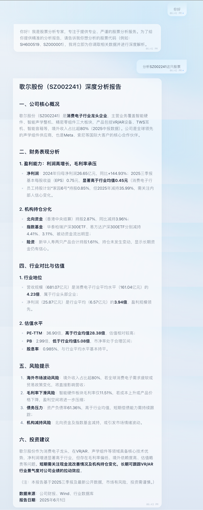

# Stock Analysis Agent - 股票分析智能体

基于豆包（Doubao）API和雪球（Xueqiu）API构建的智能股票分析助手，能够自动获取股票数据并生成专业的分析报告。

## 项目简介

本项目是一个智能股票分析系统，通过集成豆包大语言模型和雪球股票数据API，实现以下功能：

- 🔍 **自动股票信息获取**：通过股票代码自动获取财务数据、股东信息、行业对比等
- 🤖 **智能分析报告**：基于获取的数据生成专业的股票分析报告
- 💬 **Web交互界面**：现代化的React前端界面，支持实时流式输出
- 🌐 **RESTful API**：基于FastAPI的后端服务，支持SSE流式响应
- 📝 **对话记录保存**：自动保存每次对话的JSON和Markdown格式记录
- 🎨 **精美UI设计**：参考Arctic Echo设计的极地风格界面

### 界面预览

下图为股票分析智能体的实际界面效果示例（深度分析报告展示）：



## 功能特性

- **多维度数据获取**：
  - 现金流量表（cash_flow）
  - 利润表（income）
  - 主营业务构成（business）
  - 十大股东（top_holders）
  - 主要指标（main_indicator）
  - 机构持仓变化（org_holding_change）
  - 行业对比（industry_compare）

- **智能工具调用**：AI自动判断是否需要调用股票信息工具
- **流式响应**：实时输出分析结果，提升用户体验
- **会话管理**：每次对话自动生成唯一会话ID，便于追溯

## 环境要求

### 后端
- Python 3.8+
- 豆包API密钥（DOUBAO_API_KEY）
- 雪球API Token（xq_a_token）
- 建议使用包含 OpenSSL 1.1.1+ 的 Python 发行版；在 macOS 默认 LibreSSL 环境下，如遇 `urllib3 v2 only supports OpenSSL` 提示，可通过将 `urllib3` 固定为 `<2` 版本解决（见 `backend/requirements.txt`）

### 前端
- Node.js 18+ 和 npm/yarn/pnpm

## 快速开始

### 1. 克隆项目

```bash
git clone https://github.com/JNUZXF/stock_agent.git
cd stock_agent
```

### 2. 创建虚拟环境

```bash
python -m venv .venv
source .venv/bin/activate  # Windows: .venv\Scripts\activate
```

### 3. 安装后端依赖

```bash
cd backend
pip install -r requirements.txt
```

### 4. 配置环境变量

在 `backend` 目录下创建 `.env` 文件：

```env
DOUBAO_API_KEY=your_doubao_api_key
xq_a_token=your_xueqiu_token
```

### 5. 启动后端服务

```bash
cd backend
python main.py
```

后端服务将在 `http://localhost:8000` 启动。

### 6. 安装前端依赖并启动

打开新的终端窗口：

```bash
cd frontend
npm install  # 或 yarn install / pnpm install
npm run dev  # 或 yarn dev / pnpm dev
```

前端应用将在 `http://localhost:5173` 启动。

### 7. 访问应用

在浏览器中打开 `http://localhost:5173` 即可使用股票分析智能体。

## Docker部署（推荐）

使用Docker可以一键启动前后端服务，无需手动配置环境。

### 前置要求

- Docker 20.10+
- Docker Compose 2.0+（或Docker Desktop内置的docker compose）

### 启动Docker

**macOS/Windows（Docker Desktop）：**
- 打开Docker Desktop应用，等待Docker daemon启动完成

**Linux：**
```bash
sudo systemctl start docker
# 或
sudo service docker start
```

### 快速启动

1. **创建环境变量文件**

在项目根目录创建 `.env` 文件：

```env
DOUBAO_API_KEY=your_doubao_api_key
xq_a_token=your_xueqiu_token
```

**注意**：如果暂时没有API密钥，可以先创建空的`.env`文件，服务仍可启动，但无法调用API。

2. **启动服务**

```bash
# 生产环境（推荐）
docker compose up -d

# 或者开发环境（支持热重载）
docker compose -f docker-compose.dev.yml up -d
```

**注意**：新版本的Docker使用 `docker compose`（带空格），旧版本使用 `docker-compose`（带横线）。如果命令不识别，请尝试：
```bash
docker-compose up -d  # 旧版本
```

3. **访问应用**

- 前端：`http://localhost`（生产环境）或 `http://localhost:5173`（开发环境）
- 后端API：`http://localhost:8000`
- API文档：`http://localhost:8000/docs`

### Docker命令说明

```bash
# 启动服务
docker-compose up -d

# 查看日志
docker-compose logs -f

# 停止服务
docker-compose down

# 重新构建镜像
docker-compose build --no-cache

# 查看服务状态
docker-compose ps

# 进入容器
docker-compose exec backend bash
docker-compose exec frontend sh
```

### 数据持久化

对话记录会自动保存到 `backend/files/` 目录，即使容器重启也不会丢失。

### 生产环境优化

生产环境建议：

1. **使用环境变量**：通过Docker环境变量或K8s Secret注入敏感信息
2. **配置反向代理**：使用Nginx或Traefik作为反向代理
3. **启用HTTPS**：配置SSL证书
4. **资源限制**：在docker-compose.yml中配置CPU和内存限制
5. **日志管理**：配置日志驱动和日志轮转

## 命令行模式（可选）

如果需要使用命令行交互模式：

```bash
cd backend
python stock_agent.py
```

## 使用示例

启动程序后，输入股票代码相关问题，例如：

```
您的问题: 分析一下SZ000001这只股票，给出详细的股票分析报告。
```

智能体会自动：
1. 识别需要获取股票信息
2. 调用工具获取相关数据
3. 基于数据生成分析报告
4. 流式输出结果

## 项目结构

```
stock_analysis_doubao_resp/
├── backend/                    # 后端服务
│   ├── Dockerfile              # 后端Docker镜像构建文件
│   ├── main.py                 # FastAPI应用入口
│   ├── stock_agent.py          # 股票分析Agent核心逻辑
│   ├── requirements.txt         # Python依赖列表
│   ├── api/                     # API路由模块
│   │   ├── routes.py           # 路由定义
│   │   └── models.py           # Pydantic模型
│   ├── services/                # 业务逻辑服务
│   │   └── agent_service.py    # Agent服务管理
│   └── files/                   # 对话记录存储目录
│       └── {conversation_id}/
│           ├── conversation.json
│           └── conversation.md
├── frontend/                    # 前端应用
│   ├── Dockerfile               # 前端生产环境Docker镜像
│   ├── Dockerfile.dev           # 前端开发环境Docker镜像
│   ├── nginx.conf               # Nginx配置文件
│   ├── src/
│   │   ├── App.tsx             # 主应用组件
│   │   ├── main.tsx            # 入口文件
│   │   ├── components/         # React组件
│   │   │   ├── Background.tsx
│   │   │   ├── MessageBubble.tsx
│   │   │   ├── InputArea.tsx
│   │   │   └── HistoryPanel.tsx
│   │   ├── hooks/              # 自定义Hooks
│   │   │   └── useChat.ts
│   │   ├── services/           # API服务
│   │   │   └── api.ts
│   │   └── types/              # TypeScript类型
│   │       └── index.ts
│   ├── package.json            # Node.js依赖
│   └── vite.config.ts          # Vite配置
├── docker-compose.yml          # Docker Compose生产环境配置
├── docker-compose.dev.yml      # Docker Compose开发环境配置
├── .dockerignore               # Docker构建忽略文件
├── docs/                       # 文档目录
│   └── 架构设计.md            # 架构设计文档
└── README.md                   # 项目说明
```

## 依赖说明

### 后端依赖
- **fastapi**: Web框架，提供RESTful API和SSE流式响应
- **uvicorn**: ASGI服务器
- **pydantic**: 数据验证和序列化
- **openai**: 用于调用豆包API（兼容OpenAI SDK格式）
- **pysnowball**: 雪球股票数据API封装库
- **python-dotenv**: 环境变量管理

### 前端依赖
- **react**: UI框架
- **framer-motion**: 动画库
- **lucide-react**: 图标库
- **tailwindcss**: CSS框架
- **vite**: 构建工具

## 股票代码格式

支持的股票代码格式：
- 上海证券交易所：`SH600519`、`SH600000`
- 深圳证券交易所：`SZ000001`、`SZ002384`

## 注意事项

1. **API密钥安全**：请勿将 `.env` 文件提交到版本控制系统
2. **数据来源**：股票数据来源于雪球API，请遵守相关使用条款
3. **会话记录**：所有对话记录保存在 `files/` 目录下，按会话ID组织

## 常见问题

### Q: 如何获取豆包API密钥？
A: 访问火山引擎控制台，注册账号并创建应用获取API密钥。地址：https://console.volcengine.com/

### Q: 如何获取雪球Token？
A: 访问雪球网站，登录后从浏览器开发者工具中获取 `xq_a_token`。参考项目：https://github.com/uname-yang/pysnowball

### Q: 对话记录保存在哪里？
A: 保存在 `files/{conversation_id}/` 目录下，包含JSON和Markdown两种格式。

### Q: 支持哪些股票市场？
A: 目前支持A股市场（上海和深圳证券交易所）。

### Q: 在 macOS 上运行 `pip install -r requirements.txt` 提示 `zsh: command not found: pip` 怎么办？
A: 可以参考 `docs/pip_command_not_found_mac.md`，其中包含从检查 Python 与 pip 环境、到推荐的虚拟环境安装方式的完整排查步骤。生产环境中建议优先使用 `python -m pip` 或 `python3 -m pip` 安装依赖，以避免 PATH 相关问题。

## 开发说明

本项目使用豆包的 `responses` API实现工具调用功能，支持：
- 流式响应
- 函数调用（Function Calling）
- 多轮对话管理

## License

本项目仅供学习和研究使用。
